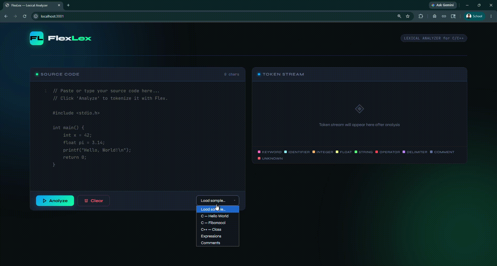
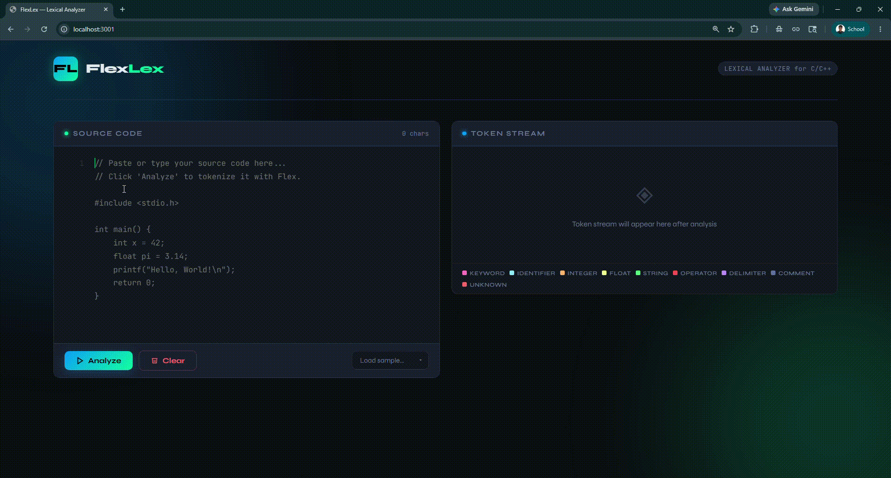
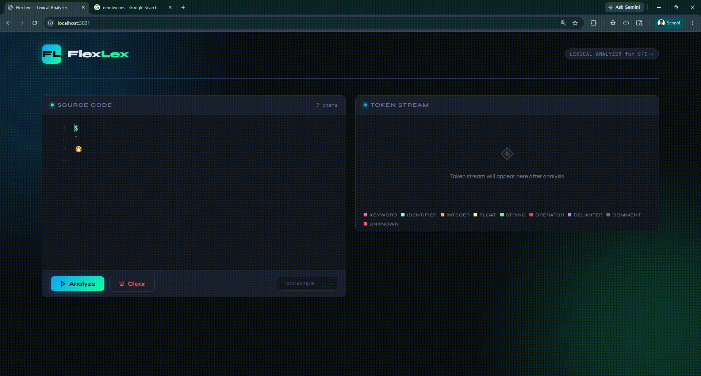
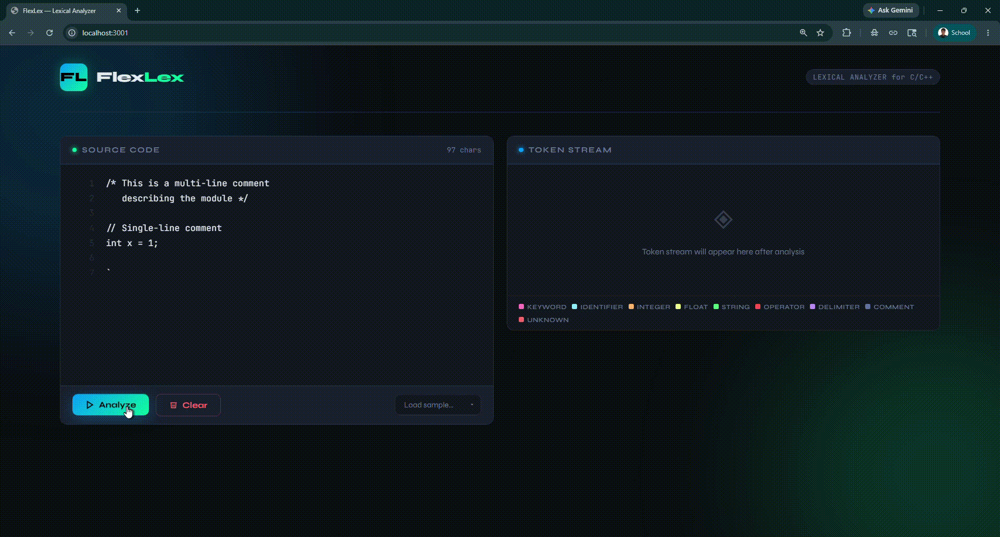

# FlexLex — Web-Based Lexical Analyzer

A lexical analyzer (tokenizer) built with **GNU Flex**, exposed through a **Node.js/Express** API and a polished **browser-based UI**.

---

## Overview

FlexLex is a full-stack application that performs **lexical analysis** on C/C++ source code. It uses **GNU Flex** to generate a C-based lexer that tokenizes input into categorized tokens — then serves those results through a REST API to an interactive web interface.

Lexical analysis is the first phase of a compiler. It reads a stream of characters and groups them into meaningful sequences called **lexemes**, each labelled with a **token type**.

---

## Features

- **Flex-powered tokenizer** — accurate, rule-based lexical analysis
- **9 token categories** — keywords, identifiers, literals, operators, delimiters, comments, and more
- **Real-time token table** — scrollable, colour-coded output with row animations
- **Summary statistics** — per-category token counts after each analysis
- **Built-in code samples** — load C/C++ snippets instantly
- **Line-numbered editor** — syntax-aware textarea with Tab support
- **REST API** — POST any source code, receive structured JSON tokens
- **Zero frontend build step** — single HTML file, no npm/webpack needed for the UI

---

## Project Structure

```
flexlex/
├── lexer/
│   ├── lexer.l          # Flex source file (grammar rules)
│   └── Makefile         # Builds lexer binary via flex + gcc
│
├── backend/
│   ├── server.js        # Express server — builds lexer, exposes API
│   └── package.json
│
├── frontend/
│   └── index.html       # Self-contained UI (HTML + CSS + JS)
│
├── package.json         # Root scripts for setup & run
├── .gitignore
└── README.md
```

---

## Token Types

| Token Type        | Description                              | Examples                          |
|-------------------|------------------------------------------|-----------------------------------|
| `KEYWORD`         | Reserved language words                  | `int`, `if`, `return`, `while`    |
| `IDENTIFIER`      | User-defined names                       | `main`, `x`, `myVariable`        |
| `INTEGER_LITERAL` | Whole number constants                   | `0`, `42`, `1000`                |
| `FLOAT_LITERAL`   | Floating-point constants                 | `3.14`, `2.0`, `1e-5`            |
| `STRING_LITERAL`  | Double-quoted string values              | `"Hello"`, `"world\n"`           |
| `OPERATOR`        | Arithmetic, logical, bitwise operators   | `+`, `==`, `&&`, `<<`, `->`      |
| `DELIMITER`       | Structural punctuation                   | `(`, `)`, `{`, `}`, `;`, `,`    |
| `COMMENT`         | Single-line `//` and multi-line `/* */`  | `// note`, `/* block */`         |
| `UNKNOWN`         | Characters not matching any rule         | `@`, `` ` ``, `$`               |

---

## Prerequisites

| Tool        | Version  | Purpose                        |
|-------------|----------|--------------------------------|
| **flex**    | ≥ 2.6    | Generate C lexer from `.l` file |
| **gcc**     | ≥ 9.0    | Compile generated C code       |
| **Node.js** | ≥ 18.0   | Run the Express backend        |
| **npm**     | ≥ 9.0    | Install Node dependencies      |

### Install Flex & GCC

**Ubuntu / Debian:**
```bash
sudo apt update && sudo apt install flex gcc build-essential -y
```

**macOS (Homebrew):**
```bash
brew install flex gcc
```

**Windows:**
Use [WSL 2](https://learn.microsoft.com/en-us/windows/wsl/) (Ubuntu) and follow the Linux steps.

---

## Installation & Setup

### 1. Clone the repository

```bash
git clone https://github.com/<your-username>/flexlex.git
cd flexlex
```

### 2. Install backend dependencies & build the lexer

```bash
npm run setup
```

This runs two commands in sequence:
- `cd backend && npm install` — installs Express and cors
- `make -C lexer` — compiles `lexer.l` → `lex.yy.c` → `lexer` binary

### Manual steps (if needed)

```bash
# Install backend packages
cd backend && npm install

# Build the Flex lexer
cd lexer && make
```

---

## Running the Application

### Start the backend server

```bash
npm start
# or for auto-reload during development:
npm run dev
```

The server will:
1. Automatically (re-)build the lexer binary on startup
2. Serve the REST API at `http://localhost:3001/api/analyze`
3. Optionally serve the frontend at `http://localhost:3001` if you copy `frontend/index.html` into `frontend/dist/`

### Open the UI

Open `frontend/index.html` directly in your browser — **no build step required**.

> **Note:** The UI makes requests to `http://localhost:3001`. If you change the port, update the `API` constant at the top of `index.html`.

---

## Using the UI

### Editor (left panel)

| Action              | How                                               |
|---------------------|---------------------------------------------------|
| Type / paste code   | Click the editor textarea and type                |
| Insert tab          | Press `Tab` (inserts 2 spaces)                    |
| Load a sample       | Use the **"Load sample…"** dropdown               |
| Clear editor        | Click the **Clear** button                        |

### Analyzing

- Click **Analyze** or press **Ctrl+Enter** (Cmd+Enter on Mac)
- The backend pipes your code through the Flex lexer binary
- Results appear in the **Token Stream** panel on the right

### Token Stream (right panel)

- Each row shows: **#** (index), **Type** (colour-coded badge), **Value**
- Hover over a long value to see the full text in a tooltip
- The **legend** at the bottom maps colours to token types

### Summary Statistics

After analysis, a stats bar appears above the token stream showing per-category counts.

---
## Sample Walktrough

### Here is the application demo:

#### Loading Sample Codes



#### Typing Code Snippets to Analyze



#### Analyzing Invalid Tokens



#### Clear Button



---

## API Reference

### `POST /api/analyze`

Tokenize a source code string.

**Request body:**
```json
{
  "code": "int x = 42;"
}
```

**Response:**
```json
{
  "tokens": [
    { "type": "KEYWORD",         "value": "int" },
    { "type": "IDENTIFIER",      "value": "x" },
    { "type": "OPERATOR",        "value": "=" },
    { "type": "INTEGER_LITERAL", "value": "42" },
    { "type": "DELIMITER",       "value": ";" }
  ],
  "summary": {
    "keywords": 1,
    "identifiers": 1,
    "integers": 1,
    "floats": 0,
    "strings": 0,
    "operators": 1,
    "delimiters": 1,
    "comments": 0,
    "unknown": 0
  }
}
```

**Error response:**
```json
{ "error": "Description of what went wrong" }
```

### `GET /api/health`

Check server status and whether the lexer binary is ready.

```json
{ "status": "ok", "lexerReady": true }
```

---

## How It Works

```
User types code
      │
      ▼
  Browser UI  ──POST /api/analyze──▶  Express Server
                                             │
                                     Write to temp file
                                             │
                                     Pipe to lexer binary
                                      (flex-generated C)
                                             │
                                    Parse stdout output
                                             │
                                      Return JSON tokens
                                             │
      ◀──────────── JSON response ───────────┘
      │
  Render token table + stats
```

### Flex compilation pipeline

```
lexer.l  ──flex──▶  lex.yy.c  ──gcc──▶  ./lexer (binary)
```

The `.l` file contains:
- **Definitions** — named regex patterns (e.g., `DIGIT [0-9]`)
- **Rules** — pattern → action pairs
- **User code** — `main()` and helper functions

---

## Extending the Lexer

To add new token types, edit `lexer/lexer.l`:

### Add a new keyword

```c
"your_keyword"  { keyword_count++; print_token("KEYWORD", yytext); }
```

### Add a new token category (e.g., preprocessor directives)

```c
/* In the definitions section */
PREPROC  ^[ \t]*#[^\n]*

/* In the rules section */
{PREPROC}  { preproc_count++; print_token("PREPROCESSOR", yytext); }
```

After editing, rebuild:
```bash
cd lexer && make
```

The server auto-rebuilds on restart (`npm start`).

---

## Troubleshooting

| Problem | Solution |
|---------|----------|
| `flex: command not found` | Install flex: `sudo apt install flex` |
| `make: gcc: No such file` | Install gcc: `sudo apt install build-essential` |
| `Cannot reach backend` | Ensure server is running on port 3001 |
| `Lexer build failed` | Check `lexer/lexer.l` for syntax errors; run `make -C lexer` manually |
| Tokens missing for a pattern | Check rule order in `lexer.l`; longer/specific rules should precede general ones |
| Port conflict | Change `PORT` in `backend/server.js` and `API` in `frontend/index.html` |
